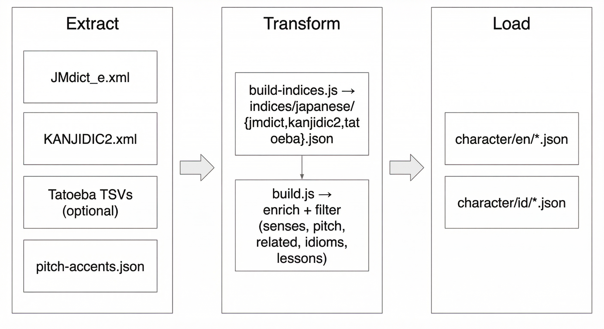

# Japanese Language Content Pipeline

## Overview

This project transforms raw Japanese dictionary data into rich, structured learning content by:

1. **Downloading** source dictionaries and sentence databases
2. **Parsing** XML/TSV data into fast JSON indices
3. **Enriching** vocabulary with linguistic metadata
4. **Generating** bilingual outputs (English and Indonesian)



The pipeline produces JSON files containing:
- Word definitions and readings
- Pitch accent patterns
- Related vocabulary
- Idioms / proverbs (from JMdict tags)
- Lessons (example sentences from Tatoeba)

## Project Structure

```
content/
├── data/japanese/          # Raw downloaded data files (git-ignored)
│   ├── JMdict_e.xml       # Japanese-English dictionary
│   ├── kanjidic2.xml      # Kanji character database
│   ├── pitch-accents.json # Pitch accent data
│   └── tatoeba/           # Example sentence pairs
│
├── indices/japanese/      # Processed JSON indices (git-ignored)
│   ├── jmdict.json        # Parsed dictionary with lookup tables
│   ├── kanjidic2.json     # Parsed kanji metadata
│   └── tatoeba.json       # Processed sentence database
│
└── scripts/japanese/      # Processing scripts
    ├── download.js        # Downloads source data
    ├── build-indices.js   # Parses data into JSON indices
    ├── generate.js        # Legacy single-word generator
    ├── build.js           # Main production builder
    └── enrich/            # Enrichment modules
        ├── pitch.js       # Pitch accent lookup
        ├── idioms.js      # Idiom/proverb extraction from JMdict
        ├── filters.js     # Content filtering
        ├── audio.js       # OpenAI TTS audio generation
        └── tags.js        # Learning tags
```

## Data Flow

```
┌─────────────────────────────────────────────────────┐
│ STEP 1: DOWNLOAD                                    │
│ download.js                                         │
│                                                     │
│ Downloads:                                          │
│  • JMdict_e.xml.gz (dictionary (defnitions,idioms))|                   
│  • kanjidic2.xml.gz (kanji data)                   │
│  • Tatoeba sentence pairs (optional)               │
│                                                     │
│ Output: data/japanese/                             │
└─────────────────────────────────────────────────────┘
                        ↓
┌─────────────────────────────────────────────────────┐
│ STEP 2: BUILD INDICES                              │
│ build-indices.js                                   │
│                                                     │
│ Parses XML/TSV into JSON:                          │
│  • Creates lookup tables for fast access           │
│  • Expands XML DTD entities                        │
│  • Builds sentence pair database                   │
│                                                     │
│ Output: indices/japanese/                          │
└─────────────────────────────────────────────────────┘
                        ↓
┌─────────────────────────────────────────────────────┐
│ STEP 3: GENERATE CONTENT                           │
│ build.js                                           │
│                                                     │
│ For each word in jlpt_files/:                      │
│  1. Lookup in JMdict                               │
│  2. Filter inappropriate content                   │
│  3. Add pitch accent data                          │
│  4. Find related vocabulary                        │
│  5. Extract idioms and proverbs                    │
│  6. Build example sentence lessons                 │
│                                                     │
│ Output: character/en/ and character/id/            │
└─────────────────────────────────────────────────────┘
```

## Setup

### Dependencies

- **dotenv** (^17.3.1) - Environment variable management
- **fast-xml-parser** (^4.5.0) - XML parsing for JMdict/KANJIDIC2
- **openai** (^6.22.0) - OpenAI API client for TTS
- **wanakana** (^5.3.1) - Japanese text conversion

## Usage

### Full Pipeline

Run the complete pipeline:

```bash
# 1. Download all source data
npm run jp:download

# Or skip Tatoeba (faster, but no example sentences)
npm run jp:download:core

# 2. Build JSON indices from downloaded data
npm run jp:build-indices

# 3. Generate content for all JLPT levels
npm run jp:words
```

### Selective Processing

Process a specific JLPT level:

```bash
node scripts/japanese/build.js --level=N5
```

Process a single word:

```bash
node scripts/japanese/build.js --word=食べる
```

## Key Scripts

### `download.js`

Downloads source data files from external repositories:

- **JMdict_e.xml.gz** - Japanese-English dictionary from edrdg.org
- **kanjidic2.xml.gz** - Kanji character database from edrdg.org
- **Tatoeba files** - Example sentence pairs (optional with `--skip-tatoeba`)

Features:
- Automatic decompression (gunzip, bunzip2, tar)
- Skips already downloaded files
- Error handling for network issues

### `build-indices.js`

Parses raw XML/TSV files into optimized JSON indices:

**For JMdict:**
- Creates `wordLookup` (kanji → entries)
- Creates `readingLookup` (hiragana → entries)
- Builds `kanjiCharIndex` for related word lookup
- Expands DTD entities in XML

**For KANJIDIC2:**
- Parses kanji metadata (meanings, readings, stroke count, JLPT level)

**For Tatoeba:**
- Links Japanese sentences with English translations
- Creates searchable sentence pairs

### `build.js` (Main Production Script)

The core content generator with full enrichment pipeline:

**Input:**
- JLPT word lists from `jlpt_files/en/*.json` and `jlpt_files/id/*.json`
- Pre-built indices from `indices/japanese/`

**Processing Pipeline:**
1. Load all indices (JMdict, KANJIDIC2, Tatoeba, pitch accents)
2. For each word:
   - Lookup dictionary entry
   - Filter out inappropriate content (vulgar, archaic)
   - Add pitch accent information
   - Find and score related words
   - Extract idioms and proverbs
   - Build lesson examples from Tatoeba sentences
3. Write bilingual JSON outputs

Outputs to `japanese/word/` directory with basic definitions and readings.

## Enrichment Features

### Pitch Accent Module (`enrich/pitch.js`)

Adds pitch accent information from external dictionary:

- Pattern type (heiban, atamadaka, nakadaka, odaka)
- Mora pattern (e.g., pattern: 2 means high on second mora)
- Human-readable descriptions

### Idioms Module (`enrich/idioms.js`)

Extracts actual Japanese idioms, proverbs, and set phrases from JMdict where the target word appears:

**Idiom types extracted:**
- **idiom** - Idiomatic expressions (慣用句)
- **proverb** - Proverbs and sayings (諺)
- **yojijukugo** - Four-character idioms (四字熟語)
- **expression** - Set phrases and collocations

Each idiom includes:
- Full phrase (kanji/kana)
- Reading (hiragana)
- English/Indonesian meaning
- Type classification

Examples are scored by relevance and frequency, with preference for common, learner-appropriate expressions.

### Filters Module (`enrich/filters.js`)

Removes inappropriate content:

- Vulgar language
- Archaic/obsolete terms
- Sensitive content
- Rare/obscure readings

Configurable for different learner audiences.

## License

Please respect the licenses of the data sources:

- JMdict and KANJIDIC2: Creative Commons Attribution-ShareAlike 3.0
- Tatoeba: Creative Commons Attribution 2.0